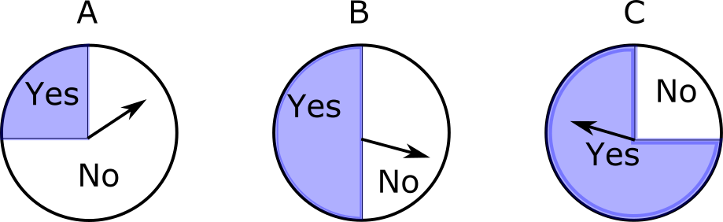

# Part I

Suppose you have three different spinners, as shown below:

When spun, the probability that the arrow lands in the "Yes" area is $\dfrac{1}{4}$, $\dfrac{1}{2}$, and $\dfrac{3}{4}$ for spinners A, B, and C respectively. 

A spinner is chosen and spun twice, and the outcome is No, No. However, you don't know which spinner was chosen.

1. What is the probability of outcome No, No for spinner A? What about for spinners B and C?

2. For which spinner is the probability of No, No the highest?

3. Which spinner would you guess was spun?

 

Now a spinner is chosen and spun four times, and the outcome is No, Yes, Yes, No. Once again, you don't know which spinner was chosen.

4. What is the probability of outcome No, Yes, Yes, No for each spinner?

5. For which spinner is the probability of the observed data (No, Yes, Yes, No) the highest?

6. Which spinner would you guess was spun?

# Part II

Let's revisit the putting data. Our regression model is

$\log \left( \dfrac{\pi}{1 - \pi} \right) = \beta_0 + \beta_1 \ \text{length},  \hspace{1cm} \text{or equivalently } \hspace{0.5cm} \pi = \dfrac{\exp\{\beta_0 + \beta_1 \ \text{length}\}}{1 + \exp\{\beta_0 + \beta_1 \ \text{length}\}}$,

where $\pi = P(\text{make the putt})$.

Suppose you attempt 15 putts, and observe the following outcomes:

| Length | 3 | 4 | 5 | 6 | 7 |
| --- | --- | --- | --- | --- | --- |
| Number of successes | 3 | 2 | 3 | 1 | 1 |
| Number of failures | 0 | 0 | 2 | 1 | 2 |

7. What is the probability of the observed data if $\beta_0 = 3$ and $\beta_1 = -0.5$?

8. What is the probability of the observed data if $\beta_0 = 4$ and $\beta_1 = -0.75$?