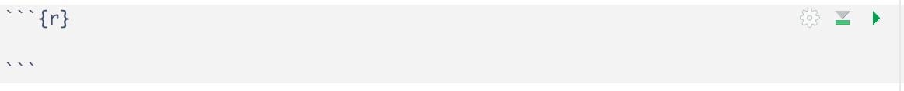
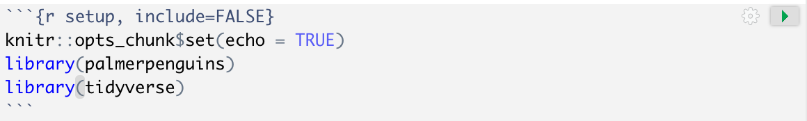

**Learning goals:** By the end of this lab, you will be able to

* Open, edit, and knit an R Markdown document
* Manipulate data frames in R
* Summarize and plot data


# Download the lab R Markdown template

```{marginfigure}
R Markdown is a super versatile tool! Most of my lectures and assignments (including this page!) are actually built with R Markdown. `.Rmd` is the file extension for R Markdown documents.
```

R Markdown allows you to create data analysis documents which combine text, code, and figures. R Markdown will be our primary tool for writing up labs, homework assignments, and projects. For this lab, I have provided a template R Markdown document (`lab_01_template.Rmd`) for you to fill in:

**Step 1:** Download the Lab 1 template file: [lab_01_template.Rmd](https://sta112-s22.github.io/labs/lab_01_template.Rmd). Save it somewhere on your computer that you can find it easily (e.g., a folder on your desktop).

**Step 2:** Rename the file to `lab_01_your_name.Rmd` (so, for example, I would call it `lab_01_ciaran_evans.Rmd`).

**Step 3:** Open `lab_01_your_name.Rmd` in RStudio.

**Step 4:** Click the `knit` button  at the top of the document. The knitted document is an HTML file that you can share (when you are finished with the lab, you will submit an HTML file on Canvas). You will re-knit your R Markdown file as you complete the lab.

# Components of an R Markdown document

## The YAML
At the very top the document, there is a section bordered by `---`. This is called the YAML, and it contains information about how to display our document. 

**Step 5:** In the YAML, change `author` from `Your Name` to your actual name (keep the quotes). For example, I would do
```
author: "Ciaran Evans"
```
Now knit the document again; your name is now displayed at the top.

## Code chunks

R Markdown is great because we can include code directly in the document. This makes it *reproducible*, because the file contains all the code we used for a data analysis. We include R code in special blocks called *chunks*. These look like


In this lab, you will use one chunk for each question. You can see that I have included them for you in the template. You will fill them in as you go through the lab.

There is also a chunk at the beginning that looks like this:

We will call this the *setup* chunk. This is where we will do things like import data and load packages. For this lab, you will need the `palmerpenguins` and `tidyverse` packages, so they have been included in the setup.

**Step 6:** Click the `Run` button  on the right of the setup chunk. The `Run` button runs code so you can experiment with data before knitting the R Markdown document.

## Text

Text you write outside of code chunks is displayed normally in the knitted HTML document. For example, `Type your answer to question 1 here...` is displayed under Exercise 1.

The `##` is used to denote a *header*. For example, `## Exercise 1` is displayed as

after you knit. The number of `#` controls how big the header is (more `#` --> smaller).

You're now ready to start working with the data! 

# Continuing penguin EDA

In the lab, you will continue to work with the `penguins` data from day 2. We will use R to conduct further exploratory data analysis on the penguins. In the process, you will learn more about working with data in R.

```{marginfigure}
Recall the pipe `%>%` from Wednesday. `%>%` means "take this, THEN do that". So `penguins %>% count(species)` means "take penguins, THEN count the number of rows for each species".
```

1. On Wednesday, we saw that there are 344 penguins in the dataset. But how many penguins of each species are there? The `count()` function counts the number of observations in each group. In the code chunk for Exercise 1 in your R Markdown document, type the following code:
```r
penguins %>%
  count(species)
```
Now hit the `Run` button for that chunk. How many penguins of each species are there? Type your answer in the R Markdown document, then knit. The knitted file should display your code and answer for Exercise 1.

2. How many penguins are there on each island? Modify the code in Exercise 1, and put it in the code chunk for Exercise 2, then type your answer below in R Markdown.

3. On Wednesday, we looked at the distribution of bill lengths in the dataset. Today, let's look at body mass. Modify code from Wednesday to create a histogram of body mass for the penguins; add this code to the chunk for Exercise 3 and run that chunk. A plot should appear in your R Markdown file, and will also be displayed when you knit. Finally, describe the distribution of body mass, based on the histogram.

4. It can also be helpful to calculate summary statistics for distributions. Add the following code to your lab report, and run:
```r
penguins %>%
  summarize(mean(body_mass_g))
```

However, we don't get a number when we run this code. What result do you get?

:::{.question}
*What's going on here?*

`summarize` is used to calculated summary statistics for a data set, and `mean` is a function for calculating the mean. In `summarize`, we specify which statistics to calculate, and on which columns.
:::

```{marginfigure}
Remember, you can learn more about a topic in R with `?`. Run `?NA` in the console to learn more about missing values.
```

5. `NA` in R means `Not Available` and results from missing values in the data. Typically, if data contain `NA`s, then a summary of that data (e.g., the mean) will also contain `NA`s. There are a wide variety of methods for handling missing data, but for now we will just remove these rows from the dataset. Add the following code to your lab report, and run
```r
penguins_no_nas <- penguins %>%
  drop_na()
```
(there's no question to answer on this exercise).

:::{.question}
*What's going on here?*

`drop_na` is a function that removes any rows containing `NA`s from the dataset. So `penguins %>% drop_na()` means "take penguins, THEN remove the missing values". The `<-` is an assignment operator. It means "store the result". So, the code creates a new data table by removing the missing values from `penguins`, and saves the new data table as `penguins_no_nas`.
:::

6. How many rows did we remove by dropping `NA`s? Add your code and response to the R markdown file. *Hint: one of the functions from Wednesday might be useful.*

7. We can finally calculate the mean body mass for penguins (after removing `NA`s). Modify the code from Exercise 4 and report the observed mean.

8. Of course, `penguins_no_nas` still has penguins from three different species. As we saw on Wednesday, the different species can have pretty different characteristics! So maybe it doesn't make sense to group all three species together into one histogram. Add and run the following code for Exercise 8:
```r
penguins_no_nas %>%
  ggplot(aes(x = body_mass_g)) +
  geom_histogram() +
  facet_wrap(~species)
```
How does the distribution of body mass differ between species?

:::{.question}
*What's going on here?*

`ggplot` builds plots layer by layer; the `+` means "add another layer". We've already seen `geom_histogram` used to create histograms. Now we're adding a *faceting* layer, which splits the plot by `species`. We'll learn more about `ggplot` and layers next week.
:::

9. If we're going to look at the distribution of body mass separately for each species, we should also calculate summary statistics separately for each species. Add and run the following code:
```r
penguins_no_nas %>%
  group_by(species) %>%
  summarize(mean(body_mass_g))
```
Report the mean for each species.

:::{.question}
*What's going on here?*

`summarize` calculates summary statistics for a dataset. `group_by` is often used before `summarize`, and it means "group the data by the values of a column". So, the code above means "take penguins_no_nas, group the penguins by their species, and within each group calculate the mean body mass".
:::
