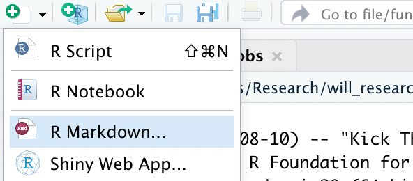
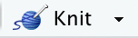
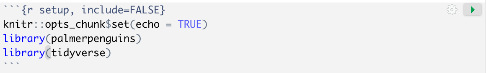

# Part I: Make a new R Markdown document

```{marginfigure}
R Markdown is a super versatile tool! Most of my lectures and assignments (including this page!) are actually built with R Markdown.
```

R Markdown allows you to create data analysis documents which combine text, code, and figures. R Markdown will be our primary tool for writing up labs, homework assignments, and projects. In the first part of this lab, you will create an new R Markdown document.

**Step 1:** Click the  button in the top left. From the dropdown menu, select `R Markdown`:


**Step 2:** A `New R Markdown` window will appear. Under `Title`, change `Untitled` to `Lab 1`. Under `Author`, type your name. Leave `Document` and `HTML` selected. Click `OK`.


**Step 3:** The new R Markdown document will probably open in the top left pane of RStudio, and be called something like `Untitled1`. When you make a new R Markdown file, RStudio automatically fills it in with some examples.


**Step 4:** Save the R Markdown file to your computer, and rename the file (`File` -> `Save As`), choosing a good location for it (e.g., your desktop). Save it as `lab_01_your_name` and click `Save`:


**Step 5:** Now go back to your Lab 1 R Markdown document, and click the `knit` button  at the top of the document. This converts it to an HTML file that you can share (when you are finished with the lab, you will submit an HTML file on Canvas). You can see that the knitted document contains plots and output.

# Part II: Code chunks

R Markdown is great because we can include code directly in the document. This makes it *reproducible*, because the file contains all the code we used for a data analysis. We include R code in special blocks called *chunks*. These look like


In the new R Markdown document you created, there is a chunk at the beginning that looks like this:

We will call this the *setup* chunk. This is where we will set up our R environment for the document.

**Step 6:** To the setup chunk, add the following lines:
```
library(palmerpenguins)
library(tidyverse)
```
so it looks like


**Step 7:** Click the `Run` button  on the right of the setup chunk. The `Run` button runs code so you can experiment with data before knitting the R Markdown document.

**Step 8:** Now let's try creating a new chunk. Click below the setup chunk, then click the `Insert new code chunk` button

**Step 8:** Finally, delete everything below the setup chunk. You will add answers and code chunks as you go through the lab.