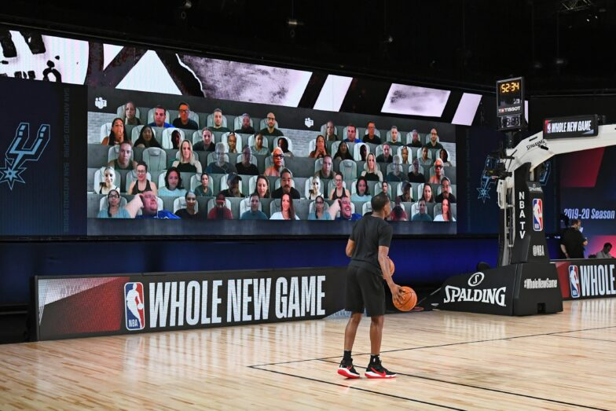

## Welcome!

.center[

]

- Dr. Ciaran Evans (he/him)
- Manchester 329
- Course website: [https://sta112-s22.github.io/](https://sta112-s22.github.io/)

.footnote[
Illustration: Updated from Grolemund & Wickham's classis R4DS schematic, envisioned by Dr. Julia Lowndes for her 2019 useR! keynote talk and illustrated by Allison Horst.
]

---

## Agenda

* Warm-up activity: getting to know each other, and how do fans impact NBA games?
* Syllabus highlights
* Plan for week 1

---

## Warm-up activity

.center[

]

* Go to [https://sta112-s22.github.io/class_activities/ca_lecture1/](https://sta112-s22.github.io/class_activities/ca_lecture1/)
* Work in small groups to answer the activity questions
* We'll reconvene to discuss in 15--20 minutes

.footnote[
Image: NBA.com
]

---

## Icebreaker: which reality show?

.center[

]

.footnote[
Image: Mark Bourdillon/C4
]

---

## Research question

--

* Do home teams perform better when they have more fans present?

---

## Data

--

* Results and attendances downloaded from [Basketball-Reference.com](https://www.basketball-reference.com/)
* Attendance data also collected from NBA and local news

--

.question[
Issue: reported attendance sometimes inaccurate!
]

---

## Methods

--

* Linear regression model
    - Includes other potential factors that could influence outcome of game
* Hypothesis tests for strength of the relationship

---

## Conclusions

--

* An increase of 1,000 home fans is associated with an increase of 1.4 points in the home team's margin of victory, after controlling for other factors
* So, home teams tend to perform better when they have more fans
* Is there anything you would do differently?

---

## Reproducibility

.question[
Could you reproduce their results?
]

--

Possibly, but it would be hard.
* Data doesn't seem to be available (we would have to collect it ourselves)
* Code for analysis not available

Extra credit 1: write code to scrape the data from Basketball-Reference.com

---

## Components of (good) data analysis

.center[

]

* Defining a clear research question
* Collecting data that can answer your question
* Data preparation: exploring, cleaning, transforming
* Investigating question with figures, tables, models
* Communicating results
* Sharing data and code to make work reproducible

.footnote[
Source: Albert Y. Kim & Johanna Hardin (2021) “Playing the Whole Game”: A Data Collection and Analysis Exercise With Google Calendar, Journal of Statistics and Data Science Education, 29:sup1, S51-S60, DOI: 10.1080/10691898.2020.1799728
]

---

.center[
# Syllabus highlights

(please see the course website [https://sta112-s22.github.io/about/](https://sta112-s22.github.io/about/) for full details)

*Syllabus may change if the public health situation and/or university policies change.*
]

---

## Class meetings

* MWF 
* Lots of activities and discussions
* Please bring your laptop each day
* *Participation:* Active participation in class and lab is important. However:
* *Attendance:* This semester, it is most important that we all stay healthy. If you are feeling ill, please let me know and take the time to recover at home.
* *Communication:* I am available by email (evansc@wfu.edu) for questions about the course or assignments. I will send messages and announcements to the class via Canvas, please make sure your account is set up to receive these notifications.

---

## Diversity and Inclusion

In this class, we will embrace diversity of age, background, beliefs, ethnicity, gender, gender identity, gender expression, national origin, neurotype, race, religious affiliation, sexual orientation, and other visible and non-visible categories. The university and I do not tolerate discrimination.

- Let me know ways to improve the effectiveness of the course for you personally, or for other students or student groups.
- *Names/Pronouns:* You deserve to be addressed in the manner you prefer. To guarantee that I address you properly, you are welcome to tell me your pronoun(s) and/or preferred name at any time, either in person or via email.

---

## Getting help

* Math and Stats center [http://mathandstatscenter.wfu.edu/student-information/](http://mathandstatscenter.wfu.edu/student-information/)
    - study sessions
    - schedule appointments
* Office hours 
    - sign up for 15-minute time slots
    - Mon 3 -- 4pm, Wed 4:30 -- 5:30pm, Thurs 12 -- 2pm
* Email (evansc@wfu.edu)

---

## Mental health

All of us benefit from support during times of struggle. You are not alone. There are many helpful
resources available on campus and an important part of the college experience is learning how to ask
for help. Asking for support sooner rather than later is often helpful.

If you or anyone you know experiences any academic stress, difficult life events, or feelings like anxiety or depression, we strongly encourage you to seek support. The University Counseling Center is here to help: call 336-758-5273 or visit their website at [https://counselingcenter.wfu.edu/](https://counselingcenter.wfu.edu/).

If you or someone you know is feeling suicidal or in danger of self-harm, call someone immediately,
day or night:
Counseling Center: 336-758-5273

If the situation is life threatening, call the police:
911 or 336-758-5911 (campus police)

---

## Accessibility

If you require accommodations due to a disability or other learning differences, contact Learning Assistance Center & Disability Services at 336-758-5929 or lacds@wfu.edu as soon as possible to better ensure that such accommodations are implemented in a timely fashion. Please feel free
to contact me, and I will be happy to discuss any necessary accommodations. I always like
to know how to help my students feel comfortable and successful in our course.

**Scent-free zone:** The 3rd floor of Manchester is a scent-free zone. Please refrain from wearing perfume, cologne, scented lotion, body spray, and all other scented products when visiting the 3rd floor.

---

## Academic integrity

**Do:**

- Work together on classwork, labs, homeworks
- Acknowledge your collaborators 
- Write up the assignments yourself
- Use the internet (e.g. StackOverflow) for help
- Cite your sources
- Work independently for projects and quizzes

**Don't:**

- Copy someone else's work
- Use resources without citation

---

## Course components

| Component | Weight |
| --------- | ------ |
| Homework  |  30%   |
| Exam 1    |  10%   |
| Exam 2    |  10%   |
| Project 1 |  35%   |
| Project 2 |  15%   |

* No final exam; Project 2 will be due during finals week

---

## Extensions and late work

**Extensions:** You have a bank of **5** extension days, which you may use over the course of the semester. You may use either one or two days for a given assignment.

**Late work:** An assignment will be marked off 20% for every 24 hours it is late (past the original due date).

Example: If an assignment is turned in:
* 30 minutes -- 24 hours late: lose 20% of points
* 24 -- 48 hours late: lose 40% of points.

If you know you cannot turn in an assignment (for instance, if you are ill or there is a family emergency), let me know before the assignment is due, and we will work something out. There will be no grade changes
after our last day of class.

---

## Plan for Week 1

* Download R and RStudio today or tomorrow
    - Instructions on course website
    - Please come to office hours or contact me if you have problems!
* Bring laptop to class from now on
* Friday: Lab 1 (in class); HW 1 released