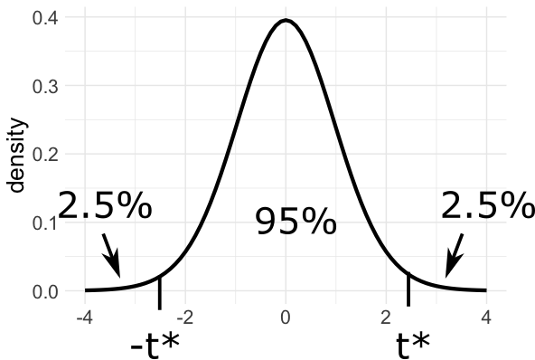

### Agenda

.large[
* Reminder: Math and Stats info sessions
  * Math: Today 2:30 - 3:30 (Zoom), 3:30 - 4:30 (in person, Manchester 124)
  * Stats: Tuesday 5 - 6 (in person, Manchester 122), Wednesday 4 - 5 (Zoom)
* Hypothesis tests for regression slope
* Confidence intervals for regression slope
]

---

### Inference

.large[
Is there a relationship between mileage and price for used Honda Accords?
]

```{r echo=F, message=F, warning=F, fig.align='center', fig.width=6, fig.height=4}
library(tidyverse)
library(Stat2Data)
data("AccordPrice")

AccordPrice %>%
  ggplot(aes(x = Mileage, y = Price)) +
  geom_point(size = 2.5) +
  labs(x = "Miles (in 1000's)",
       y = "Price (in $1000's)") +
  theme_bw() +
  theme(text = element_text(size = 25))
```

.large[
It looks like it, but is that just a fluke?
]

---

### Is the observed relationship a fluke?

.large[
What if the population scatterplot looks like this?
]

```{r echo=F, message=F, warning=F, fig.align='center', fig.width=6, fig.height=4}

AccordPrice %>%
  ggplot(aes(x = Mileage, y = Price)) +
  geom_point(size = 3) +
  geom_point(aes(x = Mileage, y = Price),
             data = data.frame(Mileage = runif(100, 0, 150),
                   Price = runif(100, 0, 30),
                   type = "Unobserved data"),
             pch = 1, alpha = 0.7, size=3) +
  labs(x = "Miles (in 1000's)",
       y = "Price (in $1000's)") +
  theme_bw() +
  theme(text = element_text(size = 25))
```

---

### Translating the question

.large[
Is there a relationship between mileage and price for used Honda Accords?
]

```{r echo=F, message=F, warning=F, fig.align='center', fig.width=6, fig.height=4}

AccordPrice %>%
  ggplot(aes(x = Mileage, y = Price)) +
  geom_point(size = 2.5) +
  labs(x = "Miles (in 1000's)",
       y = "Price (in $1000's)") +
  theme_bw() +
  theme(text = element_text(size = 25))
```

.large[
**Model:** $\text{price} = \beta_0 + \beta_1 \text{miles} + \varepsilon$

**Question:** Is $\beta_1 = 0$?
]

---

### Specifying hypotheses

.large[
**Model:** $\text{price} = \beta_0 + \beta_1 \text{miles} + \varepsilon$

**Question:** Is $\beta_1 = 0$?

**Hypotheses:**
.center[
$H_0: \beta_1 = 0$ 

$H_A: \beta_1 \neq 0$
]
]

.large[
* The *null hypothesis*, $H_0$, is that there is no relationship
* The *alternative hypothesis*, $H_A$, is that there is a relationship
* Our hypotheses are stated in terms of one or more model parameters
]

---

### Specifying hypotheses

.large[
**Model:** $\text{price} = \beta_0 + \beta_1 \text{miles} + \varepsilon$

**Hypotheses:**
.center[
$H_0: \beta_1 = 0$ 

$H_A: \beta_1 \neq 0$
]
]

.large[
.question[
What if I want to know whether there is a *positive* relationship between mileage and price?
]
]

--

.large[
.center[
$H_0: \beta_1 = 0$ 

$H_A: \beta_1 > 0$
]
]

---

### Estimating the relationship

.large[
**Model:** $\text{price} = \beta_0 + \beta_1 \text{miles} + \varepsilon$

**Hypotheses:**
.center[
$H_0: \beta_1 = 0$ 

$H_A: \beta_1 \neq 0$
]
]

.large[
**Estimated line:** $\widehat{\text{price}} = 20.8 - 0.12 \ \text{miles}$

.question[
If $\beta_1 = 0$, how unusual would $\widehat{\beta}_1 = -0.12$ be?
]
]

--

.large[
Need to know how $\widehat{\beta}_1$ varies from sample to sample
]

---

### How unusual is the observed slope?

.large[
**Standardize:** $\ \ \ \ t = \dfrac{\widehat{\beta}_1}{SE_{\widehat{\beta}_1}}$

where $SE_{\widehat{\beta}_1}$ is the estimated standard error (standard deviation) of $\widehat{\beta}_1$
]

--

.large[
**Accord data:**

```{r, eval=F}
accord_lm <- lm(Price ~ Mileage, data = AccordPrice)
summary(accord_lm)
```
]

.center[

]

---

### How unusual is the observed slope?

.large[
**Standardize:** $\ \ \ \ t = \dfrac{\widehat{\beta}_1}{SE_{\widehat{\beta}_1}}$

**Accord data:**

```{r, eval=F}
accord_lm <- lm(Price ~ Mileage, data = AccordPrice)
summary(accord_lm)
```
]

.center[

]

.large[
.center[
$t = \dfrac{-0.12}{0.014} = -8.5$
]
]

---

### How unusual is the observed slope?

.large[
.center[
$t = \dfrac{\widehat{\beta}_1}{SE_{\widehat{\beta}_1}}$
]
]

.large[
If $\beta_1 = 0$, then $t$ follows a $t$-distribution with $n-2$ degrees of freedom (df)
]

.center[
<ins>t-distributions</ins>


]

---

### How unusual is the observed slope?

.large[
$t = \dfrac{-0.12}{0.014} = -8.5$, $\ \ \ \ n - 2 = 28$

$t_{28}$ distribution:
]

```{r echo=F, fig.align='center', fig.width=6, fig.height=4}
data.frame(x = seq(-10, 10, 0.1),
           y = dt(seq(-10, 10, 0.1), 
                  28)) %>%
  ggplot(aes(x = x, y = y)) +
  geom_line(lwd = 1.5) +
  labs(x = "", y = "density") +
  geom_vline(xintercept = c(-8.5, 8.5),
             lwd = 1.5) +
  theme_minimal() +
  theme(text = element_text(size = 25)) +
  scale_x_continuous(breaks=c(-8.5, 0, 8.5))
```

---

### How unusual is the observed slope?

```{r echo=F, fig.align='center', fig.width=6, fig.height=4}
data.frame(x = seq(-10, 10, 0.1),
           y = dt(seq(-10, 10, 0.1), 
                  28)) %>%
  ggplot(aes(x = x, y = y)) +
  geom_line(lwd = 1.5) +
  labs(x = "", y = "density") +
  geom_vline(xintercept = c(-8.5, 8.5),
             lwd = 1.5) +
  theme_minimal() +
  theme(text = element_text(size = 25)) +
  scale_x_continuous(breaks=c(-8.5, 0, 8.5))
```

.large[
.question[
What fraction of the time do we see $t < -8.5$ or $t > 8.5$?
]
]

--

.large[
```{r, eval=F}
pt(-8.5, df=28, lower.tail = TRUE) + 
  pt(8.5, df=28, lower.tail = FALSE)
```
]

---

### How unusual is the observed slope?

```{r echo=F, fig.align='center', fig.width=6, fig.height=4}
data.frame(x = seq(-10, 10, 0.1),
           y = dt(seq(-10, 10, 0.1), 
                  28)) %>%
  ggplot(aes(x = x, y = y)) +
  geom_line(lwd = 1.5) +
  labs(x = "", y = "density") +
  geom_vline(xintercept = c(-8.5, 8.5),
             lwd = 1.5) +
  theme_minimal() +
  theme(text = element_text(size = 25)) +
  scale_x_continuous(breaks=c(-8.5, 0, 8.5))
```

.large[
```{r}
pt(-8.5, df=28, lower.tail = TRUE) + 
  pt(8.5, df=28, lower.tail = FALSE)
```

*If* $\beta_1 = 0$, the probability of observing $t < -8.5$ or $t > 8.5$ is approximately $0.0000000003$
]

---

### How unusual is the observed slope?

```{r echo=F, fig.align='center', fig.width=6, fig.height=4}
data.frame(x = seq(-10, 10, 0.1),
           y = dt(seq(-10, 10, 0.1), 
                  28)) %>%
  ggplot(aes(x = x, y = y)) +
  geom_line(lwd = 1.5) +
  labs(x = "", y = "density") +
  geom_vline(xintercept = c(-8.5, 8.5),
             lwd = 1.5) +
  theme_minimal() +
  theme(text = element_text(size = 25)) +
  scale_x_continuous(breaks=c(-8.5, 0, 8.5))
```

.large[
* *If* $\beta_1 = 0$, the probability of observing $t < -8.5$ or $t > 8.5$ is approximately $0.0000000003$
* *p-value* = $0.000000003$
]

---

### Putting it together

.large[
Is there a relationship between mileage and price for used Honda Accords?

**Model:** $\text{price} = \beta_0 + \beta_1 \text{mileage} + \varepsilon$

**Question:** Is $\beta_1 = 0$?

**Hypotheses:**
.center[
$H_0: \beta_1 = 0$ 

$H_A: \beta_1 \neq 0$
]
]

---

### Putting it together

.large[
.center[
$H_0: \beta_1 = 0$ 

$H_A: \beta_1 \neq 0$
]
]

.large[
**Estimated line:** $\widehat{\text{price}} = 20.8 - 0.12 \ \text{mileage}$

**Test statistic:** $\ \ \ \ t = \dfrac{\widehat{\beta}_1}{SE_{\widehat{\beta}_1}} = \dfrac{-0.12}{0.014} = -8.5$

**p-value:** 0.000000003

**Conclusion:** The observed slope of -0.12 would be <ins>very</ins> unusual if there were no relationship between mileage and price for used Honda Accords, so we have strong evidence that there is a relationship between mileage and price.
]

---

### In R

.large[
```{r, eval=F}
accord_lm <- lm(Price ~ Mileage, data = AccordPrice)
summary(accord_lm)
```
]

.center[

]

.large[
* R automatically reports p-values for tests of the form
$$H_0: \beta_1 = 0 \hspace{1cm} H_A: \beta_1 \neq 0$$
* *Don't* rely on R output for other tests, such as
  * $H_0: \beta_1 = 1 \hspace{1cm} H_A: \beta_1 \neq 1$
  * $H_0: \beta_1 = 0 \hspace{1cm} H_A: \beta_1 > 0$
]

---

### Interpreting the p-value

.large[
* **p-value:** probability of the observed data, or more "extreme" data, if the null hypothesis is true
* measures how *unusual* the observed data are, under $H_0$

What the p-value is NOT:
* The probability $H_0$ is true
* Proof that $H_0$ is true/false

In *this class*, we do not 
* Reject/accept/fail to reject the null/alternative hypotheses
* Compare the p-value to 0.05 (or 0.01, or 0.1, etc.). 
* E.g., this will be considered wrong:
  * "The p-value is less than 0.05, so we reject the null hypothesis..."

]

---

### Confidence intervals for the slope

.large[
.question[
What is a "reasonable" range of possible values for $\beta_1$, given the observed data?
]
]

--

.large[
**Confidence interval:**

.center[
$\widehat{\beta}_1 \ \pm \ t^* SE_{\widehat{\beta}_1}$
]
]

.large[
where $t^*$ = critical value of $t_{n-2}$ distribution
]

---

### $t^*$

.large[
What is $t^*$ for a 95% confidence interval?
]

.center[

]

---

### In R

.large[
Accord data: $n - 2 = 28$
]

.center[

]

.large[
```{r}
qt(0.025, df=28, lower.tail=F)
```

$t^* = 2.05$
]

---

### $t^*$

.center[

]

.large[
.question[
What do I change in my code to get the critical value for a 90% CI?
]

```{r, eval=F}
qt(0.025, df=28, lower.tail=F)
```
]

---

### $t^*$

.large[
What is $t^*$ for a 90% confidence interval?
]

.center[

]

.large[
```{r, eval=F}
qt(0.05, df=28, lower.tail=F)
```

$t^* = 1.7$
]

---

### A 95% CI for the slope

.large[
.center[
$\widehat{\beta}_1 \ \pm \ t^* SE_{\widehat{\beta}_1}$
]
]

.large[
```{r, eval=F}
summary(accord_lm)
```
]

.center[

]

.large[
```{r}
-0.12 - 2.05*0.014
-0.12 + 2.05*0.014
```
]

---

### Calculating confidence intervals

.large[
.center[
$\widehat{\beta}_1 \ \pm \ t^* SE_{\widehat{\beta}_1}$
]
]

.large[
```{r, eval=F}
summary(accord_lm)
```
]

.center[

]

.large[
95% CI for $\beta_1$: [-0.149, -0.091]

We are 95% confidence that as mileage increases by 1000 miles, the average price decreases between `$91` and `$149` in the population of all used Accords.
]

---

### Understanding confidence intervals

.large[
95% CI for $\beta_1$: [-0.149, -0.091]

We are 95% confidence that as mileage increases by 1000 miles, the average price decreases between `$91` and `$149` in the population of all used Accords.

* If I collect many datasets, and calculate a 95% CI for each one, then I expect 95% of my CIs to contain the corresponding $\beta_1$

Wrong interpretation:
* there is a 95% probability that $\beta_1$ is in [-0.149, -0.091]
]

---

### Class activity

.large[
[https://sta112-s22.github.io/class_activities/ca_lecture_9.html](https://sta112-s22.github.io/class_activities/ca_lecture_9.html)
]
